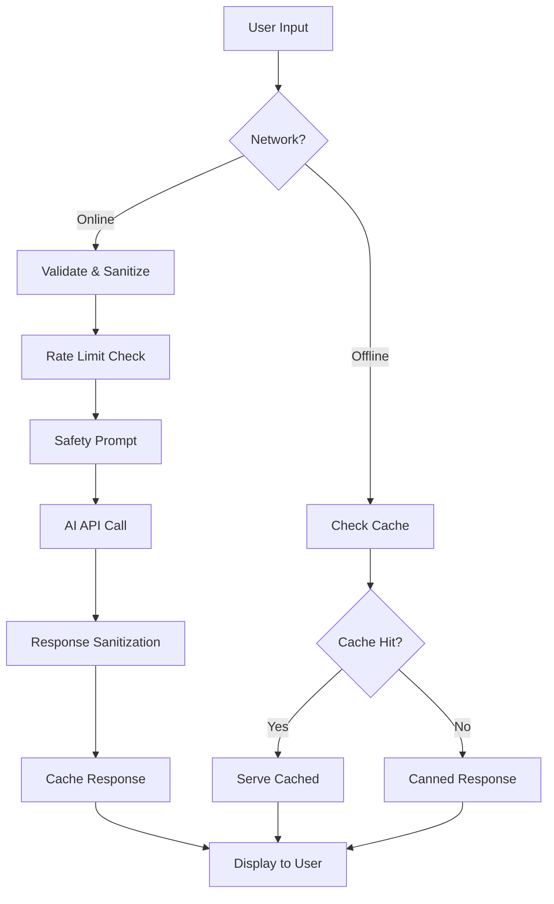
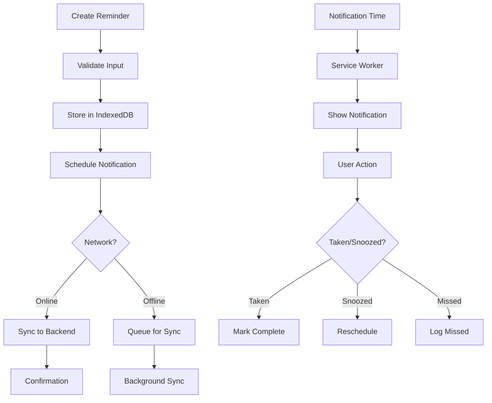
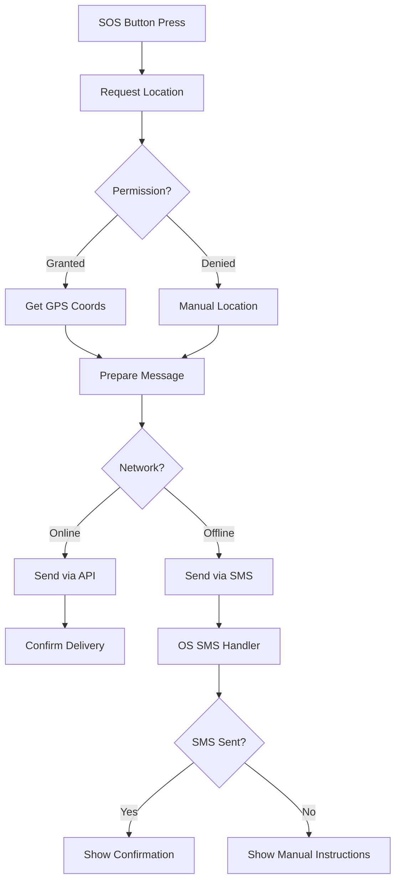

# System Architecture

## 🏗️ High-Level Architecture

MedAid follows a **Progressive Web App (PWA)** architecture with **offline-first** design principles, optimized for low-bandwidth environments and diverse device capabilities.

```
┌─────────────────┐    ┌─────────────────┐    ┌─────────────────┐
│   Client PWA    │    │   Edge/CDN      │    │  Backend APIs   │
│                 │    │                 │    │                 │
│  ┌───────────┐  │    │  ┌───────────┐  │    │  ┌───────────┐  │
│  │    UI     │  │    │  │   Cache   │  │    │  │    AI     │  │
│  │ React+TW  │  │◄──►│  │  Assets   │  │◄──►│  │ Assistant │  │
│  └───────────┘  │    │  └───────────┘  │    │  └───────────┘  │
│                 │    │                 │    │                 │
│  ┌───────────┐  │    │  ┌───────────┐  │    │  ┌───────────┐  │
│  │Service    │  │    │  │Geographic │  │    │  │Hospital   │  │
│  │Worker     │  │    │  │Distribution│  │    │  │Locator    │  │
│  └───────────┘  │    │  └───────────┘  │    │  └───────────┘  │
│                 │    │                 │    │                 │
│  ┌───────────┐  │    │  ┌───────────┐  │    │  ┌───────────┐  │
│  │IndexedDB  │  │    │  │Load       │  │    │  │Emergency  │  │
│  │Storage    │  │    │  │Balancer   │  │    │  │SOS Relay  │  │
│  └───────────┘  │    │  └───────────┘  │    │  └───────────┘  │
└─────────────────┘    └─────────────────┘    └─────────────────┘

       │                        │                        │
       ▼                        ▼                        ▼
┌─────────────────┐    ┌─────────────────┐    ┌─────────────────┐
│ Device Storage  │    │   Network       │    │  External APIs  │
│                 │    │                 │    │                 │
│ • User Prefs    │    │ • Service       │    │ • Google Maps   │
│ • Reminders     │    │   Worker        │    │ • SMS Gateway   │
│ • Cached Data   │    │ • Background    │    │ • Translation   │
│ • Offline Queue │    │   Sync          │    │ • Government    │
└─────────────────┘    └─────────────────┘    └─────────────────┘
```

## 🎭 Architecture Patterns

### 1. Offline-First Architecture
**Pattern**: Local storage as primary, sync when connected
- **Client-side state**: Redux/Zustand for app state
- **Persistent storage**: IndexedDB for user data
- **Background sync**: Service Worker for deferred operations
- **Conflict resolution**: Last-write-wins with user confirmation

### 2. Progressive Enhancement
**Pattern**: Core features work everywhere, enhanced features when supported
- **Base layer**: Text-based interface, works on all browsers
- **Enhanced layer**: Voice input/output when Web Speech API available
- **Advanced layer**: Push notifications, background sync when supported

### 3. Micro-Frontend Approach
**Pattern**: Feature-based code splitting
```
src/
├── features/
│   ├── ai-assistant/     # AI chat interface
│   ├── reminders/        # Medicine reminder system
│   ├── sos/             # Emergency SOS functionality
│   ├── i18n/            # Internationalization
│   └── voice/           # Speech recognition/synthesis
├── shared/
│   ├── components/      # Reusable UI components
│   ├── services/        # API clients, storage
│   └── utils/           # Helper functions
└── app/                 # App shell, routing
```

## 📱 Client Architecture

### React Application Structure
```jsx
// App shell with lazy-loaded features
const App = () => (
  <Router>
    <Header />
    <Suspense fallback={<Loading />}>
      <Routes>
        <Route path="/chat" component={lazy(() => import('./features/ai-assistant'))} />
        <Route path="/reminders" component={lazy(() => import('./features/reminders'))} />
        <Route path="/sos" component={lazy(() => import('./features/sos'))} />
      </Routes>
    </Suspense>
    <BottomNavigation />
  </Router>
);
```

### State Management Architecture
```typescript
// Global state structure
interface AppState {
  user: {
    language: SupportedLanguage;
    preferences: UserPreferences;
    contacts: EmergencyContact[];
  };
  reminders: {
    active: Reminder[];
    history: ReminderHistory[];
  };
  chat: {
    conversations: ChatMessage[];
    offline_responses: CannedResponse[];
  };
  network: {
    isOnline: boolean;
    quality: NetworkQuality;
  };
}
```

### Service Worker Architecture
```typescript
// sw.js - Service Worker structure
importScripts('workbox-v6.5.4/workbox-sw.js');

// Cache strategies
workbox.routing.registerRoute(
  ({request}) => request.destination === 'script' || request.destination === 'style',
  new workbox.strategies.StaleWhileRevalidate({
    cacheName: 'static-resources',
  })
);

// AI API with network-first, cache fallback
workbox.routing.registerRoute(
  '/api/ai/chat',
  new workbox.strategies.NetworkFirst({
    cacheName: 'ai-responses',
    networkTimeoutSeconds: 5,
  })
);

// Background sync for offline actions
workbox.backgroundSync.registerRoute(
  '/api/reminders',
  'reminders-queue'
);
```

## 🌐 Backend Architecture

### Serverless Functions (Firebase/Vercel)
```typescript
// AI Assistant Proxy
export default async function handler(req: Request): Response {
  // Input validation and sanitization
  const { message, language, userId } = validateInput(req.body);
  
  // Rate limiting
  await checkRateLimit(userId);
  
  // Safety prompt injection
  const safePrompt = buildSafetyPrompt(message, language);
  
  // AI API call with timeout
  const response = await openai.chat.completions.create({
    model: "gpt-3.5-turbo",
    messages: safePrompt,
    max_tokens: 200,
    temperature: 0.3,
  });
  
  // Safety post-processing
  return sanitizeResponse(response, language);
}
```

### Database Schema (Firebase Firestore)
```typescript
// User collection
interface User {
  id: string;
  phone?: string; // Optional for anonymous users
  language: SupportedLanguage;
  created_at: Timestamp;
  last_active: Timestamp;
}

// Reminders subcollection
interface Reminder {
  id: string;
  user_id: string;
  medicine_name: string;
  dosage: string;
  frequency: string; // "daily", "twice_daily", etc.
  times: string[]; // ["09:00", "21:00"]
  start_date: Timestamp;
  end_date?: Timestamp;
  is_active: boolean;
}

// SOS contacts subcollection
interface EmergencyContact {
  id: string;
  user_id: string;
  name: string;
  phone: string;
  relationship: string;
  priority: number;
}
```

## 🔄 Data Flow Diagrams

### 1. AI Chat Flow


### 2. Medicine Reminder Flow


### 3. Emergency SOS Flow


## 🗃️ Storage Architecture

### Client Storage Strategy
```typescript
// Storage layer abstraction
interface StorageAdapter {
  // User preferences (localStorage)
  setPreference(key: string, value: any): Promise<void>;
  getPreference(key: string): Promise<any>;
  
  // Structured data (IndexedDB)
  saveReminder(reminder: Reminder): Promise<void>;
  getReminders(): Promise<Reminder[]>;
  
  // Cache management (Cache API)
  cacheResponse(key: string, response: any): Promise<void>;
  getCachedResponse(key: string): Promise<any>;
}

// Implementation
class MedAidStorage implements StorageAdapter {
  private db: IDBDatabase;
  
  async init() {
    this.db = await openDB('medaid', 1, {
      upgrade(db) {
        // Reminders store
        const reminderStore = db.createObjectStore('reminders', {keyPath: 'id'});
        reminderStore.createIndex('user_id', 'user_id');
        reminderStore.createIndex('next_time', 'next_time');
        
        // Chat cache store
        const chatStore = db.createObjectStore('chat_cache', {keyPath: 'query_hash'});
        chatStore.createIndex('timestamp', 'timestamp');
        
        // SOS contacts store
        const contactsStore = db.createObjectStore('emergency_contacts', {keyPath: 'id'});
        contactsStore.createIndex('priority', 'priority');
      }
    });
  }
}
```

### Cache Strategy Matrix
| Data Type | Storage Method | TTL | Sync Strategy |
|-----------|----------------|-----|---------------|
| App Shell | Service Worker Cache | 24h | Update on app launch |
| UI Assets | Service Worker Cache | 7d | Stale while revalidate |
| AI Responses | IndexedDB | 24h | Network first, cache fallback |
| User Reminders | IndexedDB | ∞ | Immediate sync when online |
| Hospital Data | IndexedDB | 7d | Background sync daily |
| Translation Cache | IndexedDB | 30d | Lazy load, cache forever |

## 🔌 API Integration Architecture

### External API Integrations
```typescript
// API client with retry and fallback
class APIClient {
  private baseURL: string;
  private retryPolicy: RetryPolicy;
  
  async makeRequest<T>(endpoint: string, options: RequestOptions): Promise<T> {
    return this.retryPolicy.execute(async () => {
      const response = await fetch(`${this.baseURL}${endpoint}`, {
        ...options,
        timeout: 10000,
      });
      
      if (!response.ok) {
        throw new NetworkError(response.status, response.statusText);
      }
      
      return response.json();
    });
  }
}

// Service interfaces
interface AIService {
  chat(message: string, language: string): Promise<ChatResponse>;
  getFallbackResponse(symptom: string, language: string): CannedResponse;
}

interface TranslationService {
  translate(text: string, fromLang: string, toLang: string): Promise<string>;
  getOfflineTranslation(text: string, fromLang: string, toLang: string): string | null;
}

interface LocationService {
  getCurrentPosition(): Promise<GeolocationPosition>;
  findNearbyHospitals(lat: number, lng: number): Promise<Hospital[]>;
}
```

## 📡 Network Architecture

### Connection Quality Detection
```typescript
// Network quality assessment
class NetworkMonitor {
  private connection: NetworkInformation;
  
  getQuality(): NetworkQuality {
    const { effectiveType, downlink, rtt } = this.connection;
    
    if (effectiveType === '4g' && downlink > 10) return 'high';
    if (effectiveType === '3g' && downlink > 1.5) return 'medium';
    if (effectiveType === '2g' || downlink < 0.5) return 'low';
    
    return 'unknown';
  }
  
  adaptToQuality(quality: NetworkQuality): AdaptationStrategy {
    switch (quality) {
      case 'low':
        return {
          imageQuality: 'low',
          prefetchDisabled: true,
          compressionEnabled: true,
          timeoutMs: 15000,
        };
      case 'medium':
        return {
          imageQuality: 'medium',
          prefetchEnabled: false,
          compressionEnabled: true,
          timeoutMs: 8000,
        };
      case 'high':
        return {
          imageQuality: 'high',
          prefetchEnabled: true,
          compressionEnabled: false,
          timeoutMs: 5000,
        };
    }
  }
}
```

## 🛡️ Security Architecture

### Client-Side Security
- **Content Security Policy (CSP)**: Prevent XSS attacks
- **Input Validation**: Sanitize all user inputs
- **Secure Storage**: Encrypt sensitive data in IndexedDB
- **HTTPS Only**: All network communication encrypted

### API Security
- **Rate Limiting**: Prevent abuse of AI/SMS endpoints
- **Input Sanitization**: Server-side validation
- **Authentication**: Optional phone-based auth
- **Audit Logging**: Track API usage and errors

### Privacy Protection
```typescript
// Data minimization approach
interface UserData {
  // Only store essential data
  language: string;
  timezone: string;
  // No PII unless explicitly needed
  reminders: Reminder[];
  // Encrypted emergency contacts
  encryptedContacts: string;
}

// Automatic data cleanup
class DataRetentionPolicy {
  async cleanupExpiredData() {
    // Remove old chat cache (>7 days)
    await this.storage.deleteOldChatCache(7);
    
    // Remove completed reminders (>30 days)
    await this.storage.deleteOldReminders(30);
    
    // Clear temporary location data
    await this.storage.clearLocationCache();
  }
}
```

## 🔧 Development Architecture

### Build Pipeline
```yaml
# GitHub Actions workflow
name: Build and Deploy
on: [push, pull_request]

jobs:
  test:
    runs-on: ubuntu-latest
    steps:
      - name: Checkout
        uses: actions/checkout@v3
      
      - name: Setup Node
        uses: actions/setup-node@v3
        with:
          node-version: '18'
          cache: 'npm'
      
      - name: Install dependencies
        run: npm ci
      
      - name: Run tests
        run: npm run test:coverage
      
      - name: Bundle analysis
        run: npm run analyze
      
      - name: Lighthouse CI
        run: npm run lighthouse:ci

  deploy:
    needs: test
    runs-on: ubuntu-latest
    if: github.ref == 'refs/heads/main'
    steps:
      - name: Deploy to Firebase
        run: npm run deploy:prod
```

### Monitoring Architecture
```typescript
// Performance monitoring
class PerformanceMonitor {
  trackPageLoad() {
    const navigation = performance.getEntriesByType('navigation')[0];
    this.analytics.track('page_load_time', {
      ttfb: navigation.responseStart - navigation.requestStart,
      fcp: this.getFCP(),
      lcp: this.getLCP(),
    });
  }
  
  trackUserInteraction(action: string, duration: number) {
    this.analytics.track('user_interaction', {
      action,
      duration,
      network_quality: this.networkMonitor.getQuality(),
    });
  }
}

// Error tracking
class ErrorReporter {
  captureError(error: Error, context: ErrorContext) {
    // Sanitize sensitive data
    const sanitizedContext = this.sanitizeContext(context);
    
    this.errorService.report({
      message: error.message,
      stack: error.stack,
      context: sanitizedContext,
      user_language: this.i18n.currentLanguage,
      network_quality: this.networkMonitor.getQuality(),
    });
  }
}
```

## 📊 Performance Architecture

### Bundle Optimization
- **Code Splitting**: Route-based and feature-based chunks
- **Tree Shaking**: Remove unused code
- **Compression**: Gzip/Brotli for all assets
- **Critical CSS**: Inline critical styles

### Runtime Optimization
- **Virtual Scrolling**: For large lists (hospital directories)
- **Image Lazy Loading**: Defer non-critical images
- **Request Deduplication**: Prevent duplicate API calls
- **Memory Management**: Cleanup listeners and timers

### Metrics Dashboard
```typescript
// Performance budgets
const PERFORMANCE_BUDGETS = {
  initialBundle: 200 * 1024, // 200KB
  timeToInteractive: 3000,   // 3 seconds on 2G
  firstContentfulPaint: 1500, // 1.5 seconds
  cumulativeLayoutShift: 0.1,
  largestContentfulPaint: 4000,
};
```

---

This architecture supports MedAid's mission of providing reliable, accessible healthcare guidance while maintaining performance, security, and offline capabilities across diverse network conditions and devices.