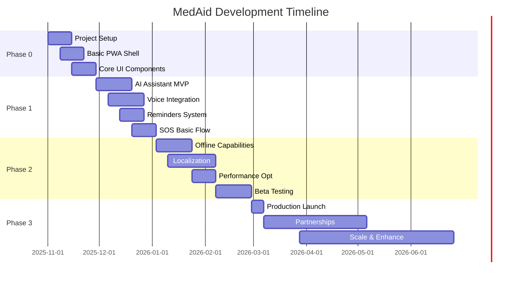

# Development Roadmap & Next Steps

## 🗺️ Project Roadmap

MedAid follows a **phased approach** with iterative releases, focusing on core functionality first and progressively adding advanced features based on user feedback and market validation.

### 📅 Timeline Overview



## 🚀 Phase 0: Foundation (2-4 weeks)

### Objectives
- Establish development infrastructure
- Create basic PWA shell with offline capability
- Implement core UI components and navigation
- Set up CI/CD pipeline

### Key Deliverables
```typescript
// Sprint 1: Project Setup (Week 1-2)
const phase0Sprint1 = {
  infrastructure: [
    'GitHub repository setup with branch protection',
    'Firebase/Supabase backend configuration',
    'Vercel/Firebase Hosting setup',
    'Environment configuration (dev/staging/prod)',
  ],
  tooling: [
    'ESLint + Prettier configuration',
    'TypeScript strict mode setup',
    'Husky pre-commit hooks',
    'GitHub Actions CI/CD pipeline',
  ],
  documentation: [
    'Development environment setup guide',
    'Code style guidelines',
    'Git workflow documentation',
    'API documentation structure',
  ]
};

// Sprint 2: PWA Foundation (Week 2-3)
const phase0Sprint2 = {
  core_app: [
    'React + TypeScript + Tailwind setup',
    'Service Worker with Workbox',
    'PWA manifest and icons',
    'Basic routing (React Router)',
  ],
  storage: [
    'IndexedDB wrapper (localForage)',
    'Basic data models and schemas',
    'Storage migration system',
    'Offline queue implementation',
  ],
  ui_framework: [
    'Design system components',
    'Responsive layout structure',
    'Theme system (light/dark)',
    'Loading states and error boundaries',
  ]
};
```

### Success Criteria
- [ ] PWA passes Lighthouse audit (>90 score)
- [ ] App works offline with cached content
- [ ] Installation flow works on mobile devices
- [ ] CI/CD pipeline passes all checks
- [ ] Bundle size <150KB (initial target)

### Team Structure (Phase 0)
| Role | Responsibility | Time Allocation |
|------|----------------|----------------|
| **Lead Developer** | Architecture, setup, code reviews | 100% |
| **UI/UX Designer** | Design system, mockups, user flows | 50% |
| **DevOps Engineer** | Infrastructure, deployment, monitoring | 25% |

---

## 🛠️ Phase 1: Core MVP (6-10 weeks)

### Objectives
- Implement core health guidance features
- Add voice input/output capabilities
- Build medicine reminder system
- Create emergency SOS functionality

### Sprint Breakdown
```typescript
// Sprint 3: AI Assistant Core (Week 4-6)
const phase1Sprint3 = {
  ai_integration: [
    'OpenAI API client with retry logic',
    'Prompt engineering for health safety',
    'Response sanitization and validation',
    'Rate limiting and abuse prevention',
  ],
  chat_ui: [
    'Chat interface with message history',
    'Typing indicators and loading states',
    'Message bubble components',
    'Error handling and retry mechanisms',
  ],
  offline_fallback: [
    'Canned response system',
    'Symptom keyword matching',
    'Offline response database',
    'Network status detection',
  ]
};

// Sprint 4: Voice & Speech (Week 6-8)
const phase1Sprint4 = {
  speech_recognition: [
    'Web Speech API integration',
    'Multi-language voice input',
    'Voice activity detection',
    'Fallback to text input',
  ],
  text_to_speech: [
    'Browser TTS implementation',
    'Voice selection by language',
    'Playback controls (pause/resume)',
    'Pre-recorded audio fallbacks',
  ],
  accessibility: [
    'Screen reader compatibility',
    'Keyboard navigation',
    'High contrast mode',
    'Large text support',
  ]
};

// Sprint 5: Medicine Reminders (Week 8-10)
const phase1Sprint5 = {
  reminder_core: [
    'Reminder CRUD operations',
    'Scheduling algorithm',
    'Notification system',
    'Snooze functionality',
  ],
  notification_system: [
    'Browser notification API',
    'Service worker notifications',
    'Permission handling',
    'Fallback strategies',
  ],
  data_persistence: [
    'IndexedDB reminder storage',
    'Sync queue for offline operations',
    'Data export/import',
    'Backup and restore',
  ]
};

// Sprint 6: Emergency SOS (Week 10-12)
const phase1Sprint6 = {
  location_services: [
    'Geolocation API integration',
    'Permission handling',
    'Location accuracy validation',
    'Manual location entry fallback',
  ],
  emergency_contacts: [
    'Contact management CRUD',
    'Contact priority system',
    'Encryption for contact data',
    'Contact verification',
  ],
  sos_transmission: [
    'SMS gateway integration',
    'Emergency message templates',
    'Delivery confirmation',
    'Retry mechanisms',
  ]
};
```

### Key Features Implementation
```typescript
// AI Assistant Implementation Priority
interface AIFeaturePriority {
  critical: [
    'Basic symptom query handling',
    'Safety disclaimers on all responses',
    'Red flag detection (emergency symptoms)',
    'Rate limiting (10 queries/hour)',
  ];
  important: [
    'Multi-language response generation',
    'Context-aware follow-up questions',
    'Response quality scoring',
    'Fallback to canned responses',
  ];
  nice_to_have: [
    'Personalized health profiles',
    'Medical history integration',
    'Appointment booking suggestions',
    'Health trend analysis',
  ];
}

// Voice Feature Implementation
interface VoiceFeaturePriority {
  critical: [
    'Hindi and English voice input',
    'Text-to-speech in all supported languages',
    'Microphone permission handling',
    'Fallback to text when voice fails',
  ];
  important: [
    'Regional language voice input (Telugu, Tamil, etc.)',
    'Voice command shortcuts',
    'Background noise handling',
    'Voice quality optimization',
  ];
}
```

### Team Expansion (Phase 1)
| Role | New Additions | Responsibility |
|------|---------------|----------------|
| **Backend Developer** | +1 | API development, database design |
| **Mobile Specialist** | +1 | PWA optimization, mobile UX |
| **QA Engineer** | +1 | Testing automation, device testing |
| **Medical Advisor** | +0.5 | Content review, safety validation |

---

## 🌟 Phase 2: Enhancement & Scale (6-8 weeks)

### Objectives
- Complete localization for all 6 languages
- Optimize performance for 2G networks
- Implement advanced offline capabilities
- Conduct comprehensive beta testing

### Sprint Breakdown
```typescript
// Sprint 7: Localization (Week 12-15)
const phase2Sprint7 = {
  translation_system: [
    'IndicTrans2 offline translation integration',
    'Google Translate API fallback',
    'Translation caching system',
    'Quality assurance workflow',
  ],
  content_localization: [
    'UI strings in all 6 languages',
    'Medical content translation',
    'Cultural adaptation review',
    'Native speaker validation',
  ],
  font_optimization: [
    'Indic script font loading',
    'Font subsetting for size optimization',
    'Fallback font stacks',
    'Typography consistency',
  ]
};

// Sprint 8: Performance Optimization (Week 15-17)
const phase2Sprint8 = {
  bundle_optimization: [
    'Code splitting by routes and features',
    'Tree shaking unused dependencies',
    'Dynamic imports for heavy components',
    'Bundle size analysis and monitoring',
  ],
  network_optimization: [
    'Adaptive loading based on connection',
    'Image optimization and lazy loading',
    'API response compression',
    'Critical CSS inlining',
  ],
  offline_enhancement: [
    'Advanced service worker strategies',
    'Background sync improvements',
    'Offline indicator and handling',
    'Cache management and eviction',
  ]
};

// Sprint 9: Beta Testing Preparation (Week 17-19)
const phase2Sprint9 = {
  testing_infrastructure: [
    'End-to-end testing with Cypress',
    'Cross-browser testing setup',
    'Device testing lab configuration',
    'Performance monitoring integration',
  ],
  beta_features: [
    'Feedback collection system',
    'Analytics and crash reporting',
    'A/B testing framework',
    'Feature flag system',
  ],
  documentation: [
    'User onboarding flow',
    'Help documentation in all languages',
    'FAQ system',
    'Video tutorials',
  ]
};
```

### Performance Targets
```typescript
// Performance budgets for Phase 2
const performanceTargets = {
  bundle_size: {
    initial: '200KB (gzipped)',
    total: '1MB (all chunks)',
    target_reduction: '25% from Phase 1',
  },
  loading_performance: {
    fcp: '<1.5s on 2G',
    lcp: '<4s on 2G',
    tti: '<3s on 2G',
    cls: '<0.1',
  },
  runtime_performance: {
    memory_usage: '<50MB peak',
    battery_impact: 'Minimal (background activity <5%)',
    cpu_usage: '<10% average on low-end devices',
  },
  network_efficiency: {
    api_calls: '<5 requests per user action',
    data_usage: '<100KB per session',
    offline_capability: '>80% features work offline',
  }
};
```

### Beta Testing Strategy
```typescript
// Beta testing phases and criteria
const betaTestingPhases = {
  internal_beta: {
    duration: '2 weeks',
    participants: '10 team members + advisors',
    focus: 'Core functionality, critical bugs',
    devices: ['Android budget phones', 'iPhones', 'KaiOS'],
    success_criteria: [
      'Zero critical bugs',
      '100% feature completion',
      'Performance targets met',
    ]
  },
  
  closed_beta: {
    duration: '3 weeks', 
    participants: '50 users from target demographics',
    focus: 'User experience, language accuracy, real usage',
    recruitment: ['Rural healthcare workers', 'Elderly users', 'Regional language speakers'],
    success_criteria: [
      'NPS >7/10',
      '90% task completion rate',
      '<5% critical error rate',
    ]
  },
  
  open_beta: {
    duration: '4 weeks',
    participants: '500 users across India',
    focus: 'Scale testing, edge cases, diverse usage patterns',
    distribution: ['Google Play Store (beta track)', 'Direct PWA installs'],
    success_criteria: [
      '95% uptime',
      '<2% crash rate',
      'Positive user feedback',
    ]
  }
};
```

---

## 🎯 Phase 3: Production & Growth (Ongoing)

### Objectives
- Launch stable production version
- Establish partnerships with healthcare organizations
- Scale infrastructure and team
- Add advanced features based on user feedback

### Launch Strategy
```typescript
// Production launch checklist
const productionLaunch = {
  technical_readiness: [
    'Security audit completed',
    'Performance benchmarks met', 
    'Accessibility compliance (WCAG 2.1 AA)',
    'Legal compliance review',
    'Privacy policy and terms published',
    'Content moderation system active',
  ],
  
  operational_readiness: [
    'Monitoring and alerting configured',
    'Customer support system ready',
    'Incident response procedures documented',
    'Backup and disaster recovery tested',
    'Team training completed',
  ],
  
  business_readiness: [
    'Go-to-market strategy finalized',
    'Partnership agreements signed',
    'PR and marketing materials ready',
    'User onboarding flow optimized',
    'Success metrics defined',
  ]
};
```

### Partnership Strategy
```typescript
// Strategic partnerships for scale and impact
const partnershipPlan = {
  healthcare_organizations: [
    {
      type: 'Government Health Departments',
      value: 'Official endorsement, distribution through health centers',
      timeline: 'Month 3-6',
      requirements: ['Compliance certification', 'Pilot program success'],
    },
    {
      type: 'NGOs and Healthcare NPOs',
      value: 'Ground-level distribution, feedback, credibility',
      timeline: 'Month 1-3',
      requirements: ['Beta testing participation', 'Impact measurement'],
    },
    {
      type: 'Telemedicine Platforms',
      value: 'Doctor escalation, professional consultation integration',
      timeline: 'Month 6-12',
      requirements: ['API integration', 'Medical professional network'],
    }
  ],
  
  technology_partners: [
    {
      type: 'Telecom Operators',
      value: 'SMS gateway, data-free access, rural distribution',
      timeline: 'Month 2-4',
      requirements: ['Zero-rating negotiations', 'SMS cost optimization'],
    },
    {
      type: 'Device Manufacturers',
      value: 'Pre-installation, optimized performance',
      timeline: 'Month 6-12',
      requirements: ['Partnership agreements', 'Technical integration'],
    }
  ]
};
```

### Advanced Features Roadmap
```typescript
// Post-MVP feature priorities based on user feedback
const advancedFeatures = {
  quarter_1: [
    'Hospital bed availability integration',
    'Medicine price comparison',
    'Health record storage (encrypted)',
    'Family account management',
  ],
  
  quarter_2: [
    'Live doctor consultation booking',
    'AI-powered health insights',
    'Community health forums',
    'Integration with fitness trackers',
  ],
  
  quarter_3: [
    'Chronic disease management',
    'Ayurvedic and traditional medicine guidance',
    'Healthcare provider network',
    'Insurance integration',
  ],
  
  quarter_4: [
    'Predictive health analytics',
    'Government scheme integration (Ayushman Bharat)',
    'Pharmacy delivery partnerships',
    'Enterprise health dashboard',
  ]
};
```

## 📊 Success Metrics & KPIs

### Product Metrics
```typescript
interface ProductMetrics {
  adoption: {
    total_installs: number;          // Target: 100K in Year 1
    monthly_active_users: number;    // Target: 70% of installs
    daily_active_users: number;      // Target: 30% of MAU
    retention_7_day: number;         // Target: >60%
    retention_30_day: number;        // Target: >40%
  };
  
  engagement: {
    sessions_per_user: number;       // Target: >5 per month
    session_duration: number;        // Target: 3-5 minutes
    features_used_per_session: number; // Target: >2
    voice_usage_rate: number;        // Target: >40%
    offline_usage_rate: number;      // Target: >30%
  };
  
  quality: {
    crash_rate: number;              // Target: <1%
    error_rate: number;              // Target: <2%
    load_time_p95: number;           // Target: <3s on 2G
    user_satisfaction_nps: number;    // Target: >7/10
    medical_safety_incidents: number; // Target: 0
  };
}
```

### Business Impact Metrics
```typescript
interface BusinessMetrics {
  reach: {
    rural_user_percentage: number;   // Target: >60%
    regional_language_usage: number; // Target: >70%
    elderly_user_adoption: number;   // Target: >30%
    low_income_user_reach: number;   // Target: >50%
  };
  
  social_impact: {
    healthcare_access_improvement: string;
    emergency_response_success_rate: number;
    user_health_knowledge_increase: number;
    healthcare_cost_reduction: number;
  };
  
  sustainability: {
    cost_per_user_per_month: number; // Target: <₹10
    revenue_per_user: number;        // Future: partnerships
    infrastructure_costs: number;    // Target: <30% of budget
    team_productivity: number;       // Lines of code per developer
  };
}
```

## 🎯 Quick Wins & Risk Mitigation

### Immediate Quick Wins (Week 1-2)
```typescript
const quickWins = {
  technical: [
    'Set up basic React + TypeScript project → Immediate development start',
    'Deploy hello-world PWA to production → Test deployment pipeline',
    'Implement basic offline caching → Core PWA functionality',
    'Add Hindi language toggle → Show multilingual capability',
  ],
  
  business: [
    'Create social media presence → Build community early',
    'Write and publish privacy policy → Build trust',
    'Set up feedback collection → Start user research',
    'Demo video in Hindi and English → Show value proposition',
  ],
  
  partnerships: [
    'Reach out to 3 healthcare NGOs → Get early feedback',
    'Connect with rural healthcare workers → Understand needs',
    'Contact medical college students → Get content review help',
    'Engage with accessibility communities → Ensure inclusive design',
  ]
};
```

### Risk Mitigation Strategies
```typescript
const riskMitigation = {
  technical_risks: {
    'AI response quality': {
      mitigation: ['Curated canned responses', 'Medical expert review', 'User feedback loop'],
      fallback: 'Offline-only version with basic guidance',
    },
    'Performance on low-end devices': {
      mitigation: ['Progressive enhancement', 'Device-specific optimization', 'Lite version'],
      fallback: 'Basic HTML version with minimal JavaScript',
    },
    'Translation accuracy': {
      mitigation: ['Native speaker review', 'Community translation', 'Iterative improvement'],
      fallback: 'English-only launch with gradual language addition',
    }
  },
  
  business_risks: {
    'Medical liability': {
      mitigation: ['Strong disclaimers', 'Legal review', 'Insurance coverage'],
      fallback: 'Information-only mode without direct health advice',
    },
    'Regulatory compliance': {
      mitigation: ['Early legal consultation', 'Conservative approach', 'Government engagement'],
      fallback: 'Wellness app pivot without medical claims',
    },
    'User adoption in target demographic': {
      mitigation: ['Community partnerships', 'Offline marketing', 'Word-of-mouth incentives'],
      fallback: 'Urban market focus with rural expansion later',
    }
  }
};
```

## 🏁 Next Immediate Steps (Week 1)

### Day 1-2: Project Setup
```bash
# Repository and infrastructure setup
git init medaid
npm create react-app medaid --template typescript
cd medaid
npm install @tailwindcss/cli workbox-webpack-plugin
npx tailwindcss init

# Set up development environment
cp .env.example .env.local
npm run build
npm run test
```

### Day 3-5: Core Foundation
```typescript
// Implement basic app structure
const immediateImplementation = {
  components: [
    'App shell with navigation',
    'Language selector component', 
    'Basic chat interface',
    'Reminder list component',
    'SOS button component',
  ],
  
  services: [
    'Storage service (IndexedDB wrapper)',
    'i18n service (basic English/Hindi)',
    'PWA service worker',
    'Network status service',
  ],
  
  pages: [
    'Home/Dashboard',
    'Chat interface',
    'Reminders management',
    'Emergency SOS',
    'Settings',
  ]
};
```

### Day 6-7: MVP Demo
```typescript
// Create working demo with:
const demoFeatures = [
  'Language switching (English/Hindi)',
  'Basic chat with canned responses',
  'One sample medicine reminder',
  'SOS button (mock functionality)',
  'PWA installation flow',
];

// Demo script for stakeholders
const demoScript = `
1. Show app installation on mobile
2. Demonstrate language switching
3. Chat interaction in Hindi
4. Set up a medicine reminder
5. Show SOS functionality
6. Demonstrate offline capability
`;
```

---

**Ready to Begin**: This roadmap provides a clear, actionable path from concept to production. The next step is to begin Phase 0 implementation with the foundation setup and basic PWA structure.

Would you like me to start implementing any specific part of this roadmap, or would you prefer to see additional documentation for any particular phase?